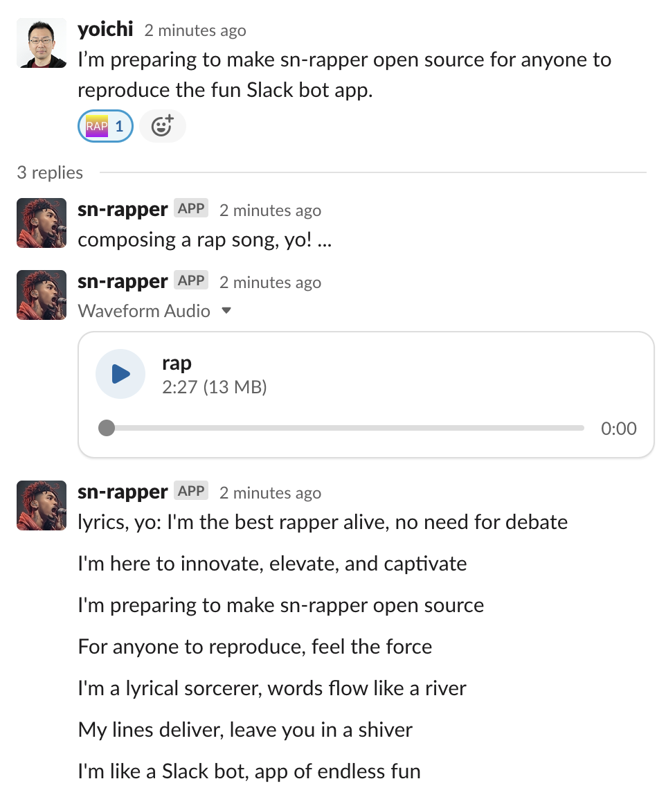

# sn-rapper: Slack Native Rapper

Looking for a fun feature on Slack? Check out sn-rapper! It has the ability to transform any Slack message into a catchy rap song, complete with fantastic lyrics and vocal audio🎶. All you need to do is apply a `:rap:` reaction to a Slack message. Enjoy!



<audio controls>
  <source src="docs/media/rap.mp3" type="audio/mpeg">
  Your browser does not support the audio element.
</audio>

# Preparation

## Prepare Slack

Follow these or similar instructions to set up your Slack app.

- https://slack.dev/bolt-python/tutorial/getting-started
- https://www.twilio.com/blog/how-to-build-a-slackbot-in-socket-mode-with-python

**OAuth & Permissions:**
Under OAuth & Permissions menu, add the scopes below to "Bot Token Scopes"

- channels:history
- chat:write
- files:write
- groups:history
- im:history
- mpim:history

**Event Subscriptions:**
Under Event Subscriptions menu, turn on "Enable Events" with "reactions:read" scope in "Subscribe to bot events" added.

**Tokens:**
Obtain `Bot User OAuth Token` and `App-Level Token` to put in `.env` file below.

**Install App:**
Whenever you made changes on the Slack settings, install the Slack app in Install App menu.
After the installation, invite the app to a channel where you want to interact with the bot app.
If your Slack workspace doesn't have `:rap:` reaction icon yet, make and add the reaction icon.

## Prepare Uberduck.ai

Subscribe [Uberduck.ai](https://uberduck.ai/) and obtain API and secret keys to put in `.env` file below.

## Prepare .env file

Create a `.env` file with the following contents within the project directory.

```
SLACK_BOT_USER_OAUTH_TOKEN="YOUR BOT USER OAUTH TOKEN HERE"
SLACK_APP_TOKEN="YOUR APP-LEVEL TOKEN HERE"
UBERDUCK_API_KEY="YOUR UBERDUCK API KEY HERE"
UBERDUCK_SECRET_KEY="YOUR UBERDUCK SECRET KEY HERE"
```

# How to Run

1. Install Pipenv if you don't have. Then run `pipenv install` to install dependency.
2. After that, run `pipenv run start` command to start receiving events from Slack.
3. Put `:rap:` reaction to a message in the channel you invited the Slack app. You'll see sn-rapper compose a rap song, and post an audio and its lyrics in the thread.

# Troubleshooting

If you cannot receive events from Slack, try another network or wi-fi. If your network has firewall or other security features enabled, you might not able to receive the events. If it does not work too, try modifying and deploying the code to somewhere like AWS Lambda or Google Cloud Functions to receive the events from Slack.

# License

The MIT License

# Acknowledgement

This program was made at a hackathon event at SmartNews.
